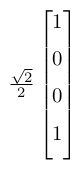
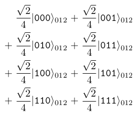

# How-to Guides

## **Visualizing quantum states**

QIRT provides a powerful `draw` method to visualize quantum states in various formats. This method offers flexibility in how you want to represent and view your quantum states.

### Basic Usage

To visualize a quantum state, simply call the `draw` method on a `QuantumState` object:

```python
from QIRT import QuantumState

state = QuantumState.from_label((1/math.sqrt(2), "00"), (-1j/math.sqrt(2), "11"))
state.draw()
```

By default, this will produce a LaTeX representation of the state.

### Customizing the Output

The `draw` method accepts several parameters to customize the visualization:

1. Output Format

    You can specify the output format using the `output` parameter:

    ```python
    # LaTeX format (default)
    state.draw(output="latex")

    # Matrix format
    state.draw(output="matrix")
    ```

2. Target Basis

    You can visualize the state in different bases:

    ```python
    # Visualize in X-basis
    state.draw(target_basis="x")

    # Visualize in Y-basis
    state.draw(target_basis="y")

    # Mix of bases
    state.draw(target_basis=["x", "z"])  # For a two-qubit state
    ```

3. Qubit Indexing

    Control whether to show qubit indices:

    ```python
    # Hide qubit indices
    state.draw(show_qubit_index=False)
    ```

4. Output Length

    Control how many terms appear per line:

    ```python
    # 8 terms per line (2^3)
    state.draw(output_length=3)
    ```

5. LaTeX Source

    Get the LaTeX source code instead of rendering:

    ```python
    latex_source = state.draw(source=True)
    print(latex_source)
    ```

### Examples

Let's go through some examples to showcase these features:

1. Visualizing a Bell state

    ```python
    bell_state = QuantumState.from_label((1/math.sqrt(2), "00"), (1/math.sqrt(2), "11"))
    bell_state.draw()
    ```

    \>> Output:
    $\frac{\sqrt{2}}{2}|\texttt{00}\rangle_{01} + \frac{\sqrt{2}}{2}|\texttt{11}\rangle_{01}$

2. Matrix representation

    ```python
    # This will display the state vector as a column matrix.
    bell_state.draw(output="matrix")
    ```

    \>> Output:  
    

3. Changing basis

    ```python
    # This will show the Bell state represented in the X-basis.
    bell_state.draw(target_basis="x")
    ```

    \>> Output: $ \\frac{\\sqrt{2}}{2}|\\texttt{++}\\rangle_{01} +\\frac{\\sqrt{2}}{2}|\\texttt{--}\\rangle_{01} $

4. Changing output length

    ```python
    complex_state = QuantumState.from_label("000", "001", "010", "011", "100", "101", "110", "111")
    # This will display the state with (2^output_length) terms per line.
    complex_state.draw(output_length=1)
    ```

    \>> Output:  
    

### Tips for Effective Visualization

- Use `output="latex"` for clear, readable representations in Jupyter notebooks.
- Experiment with different bases to gain insights into your quantum state.
- Adjust `output_length` for better readability with multi-qubit states.
- Use `source=True` if you need to further process or customize the LaTeX output.

By mastering the `draw` method, you can effectively visualize and analyze your quantum states in QIRT, aiding in both understanding and debugging your quantum algorithms.

## **Creating quantum states using ket notation with coefficients**

QIRT provides a powerful and flexible method `from_label` to create quantum states. This method allows you to specify states using ket notation, with or without coefficients. Let's explore various ways to use this method.

### Basic Usage

To create a simple quantum state, you can use string labels:

```python
from QIRT import QuantumState

# Create an equal superposition of |0⟩ and |1⟩
state = QuantumState.from_label("0", "1")
state.draw(target_basis="z")
```

\>> Output: $ \\frac{\\sqrt{2}}{2}|\\texttt{0}\\rangle_{0} +\\frac{\\sqrt{2}}{2}|\\texttt{1}\\rangle_{0} $

### Multi-Qubit States

You can create multi-qubit states by providing longer string labels:

```python
# Create an equal superposition of all two-qubit states
state = QuantumState.from_label("00", "01", "10", "11")
state.draw(target_basis="zz")
```

\>> Output: $ \\frac{1}{2}|\\texttt{00}\\rangle_{01} +\\frac{1}{2}|\\texttt{01}\\rangle_{01} +\\frac{1}{2}|\\texttt{10}\\rangle_{01} +\\frac{1}{2}|\\texttt{11}\\rangle_{01} $

### Using Different Bases

QIRT supports different bases (X, Y, Z) in state creation:

```python
# Create a state in the X-basis
state = QuantumState.from_label("+", "-")
state.draw(target_basis="x")
```

\>> Output: $ \\frac{\\sqrt{2}}{2}|\\texttt{+}\\rangle_{0} + \\frac{\\sqrt{2}}{2}|\\texttt{-}\\rangle_{0} $

### States with Coefficients

You can specify complex coefficients for each ket:

(**Note:** QIRT automatically normalizes the coefficients so don't worry about the normalization factor)

```python
# Create a state with specific coefficients
state = QuantumState.from_label("0", (-1, "1"))
state.draw(target_basis="z")
```

\>> Output: $ \\frac{\\sqrt{2}}{2}|\\texttt{0}\\rangle_{0} - \\frac{\\sqrt{2}}{2}|\\texttt{1}\\rangle_{0} $

```python
# Create a state with complex coefficients
state = QuantumState.from_label("0", (1j, "1"))
state.draw(target_basis="z")
```

\>> Output: $ \\frac{\\sqrt{2}}{2}|\\texttt{0}\\rangle_{0} +\\frac{\\sqrt{2} i}{2}|\\texttt{1}\\rangle_{0} $

### Notes on Usage

- Coefficients can be real or complex numbers.
- The method supports various notations: computational basis (0,1), X-basis (+,-), and Y-basis (i,j).
- For multi-qubit states, use concatenated labels (e.g., "00", "01").
- The resulting state is always normalized.

By mastering `from_label`, you can easily create a wide variety of quantum states in QIRT, from simple single-qubit states to complex multi-qubit entangled states.

## **Customizing ket notation with configuration file**

QIRT utilizes a configuration file to customize the ket notation. This file is located at `~/.QIRT/config.ini` in your home directory. You can modify the ket notation by editing the `config.ini` file. Here's an example of the default configuration:

```ini
[ket]
z0 = 0
z1 = 1
x0 = +
x1 = -
y0 = i
y1 = j
```

This configuration defines how different basis states are represented:

- `z0` and `z1` represent the computational basis states
- `x0` and `x1` represent the X-basis states
- `y0` and `y1` represent the Y-basis states

Feel free to adjust these values to match your preferred notation or to align with specific conventions in your work.

**Note:** After making changes to the configuration file, you must restart your Jupyter kernel or Python interpreter for the changes to take effect. This ensures that QIRT loads the updated configuration properly.
