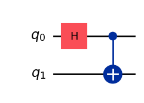
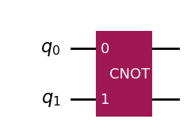

# Creating Quantum Circuits with Matrices and Qiskit provides gate

This guide covers advanced techniques for creating quantum circuits in QIRT, including method chaining and adding custom unitary operators.

## Method Chaining

QIRT's `QuantumCircuit` class supports method chaining, which allows you to build circuits more concisely. Here's how you can create a Bell state circuit using method chaining:

```python
from QIRT import QuantumCircuit

# Create a two-qubit quantum circuit and add gates using method chaining
circuit = QuantumCircuit(2).h(0).cx(0, 1)

# Visualize the circuit
circuit.draw()
```

\>> Output:



Method chaining can make your code cleaner and more readable, especially for constructing more complex circuits.

## Adding Custom Unitary Operators

QIRT allows you to add custom unitary operators to your quantum circuits using the `unitary` method. This is particularly useful when you want to apply a specific unitary transformation that isn't available as a built-in gate.

### Example: Adding a CNOT Gate

Let's add a CNOT gate to a quantum circuit using the `unitary` method:

```python
from QIRT import QuantumCircuit

# Create a quantum circuit
circ = QuantumCircuit(2)

# Unitary matrix for a CNOT gate
cnot_matrix = [ 
                [1, 0, 0, 0],
                [0, 1, 0, 0],
                [0, 0, 0, 1],
                [0, 0, 1, 0]
              ]

# Add a CNOT gate to the circuit using a unitary matrix
circ.unitary(matrix=cnot_matrix, qubits=[0,1], label='CNOT')

# Visualize the circuit
circ.draw()
```

\>> Output:



This adds a CNOT gate to the circuit using a unitary matrix.

The `unitary` method allows you to apply any custom unitary matrix to specified qubits. The `matrix` parameter takes the unitary matrix, `qubits` specifies which qubits to apply the gate to, and `label` allows you to give a name to your custom gate.

## Finding More Quantum Gates

QIRT is built on top of Qiskit, which is a comprehensive and widely-used framework for quantum computing. As such, QIRT provides support for many different quantum gates. To explore all available gates and their usage, you can refer to the [Qiskit Circuit Library](https://docs.quantum.ibm.com/api/qiskit/circuit_library).
