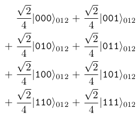

# Visualizing Quantum States

QIRT provides a powerful `draw` method to visualize quantum states in various formats. This method offers flexibility in how you want to represent and view your quantum states.

## Basic Usage

To visualize a quantum state, simply call the `draw` method on a `QuantumState` object:

```python
from QIRT import QuantumState

state = QuantumState.from_label((1/math.sqrt(2), "00"), (-1j/math.sqrt(2), "11"))
state.draw()
```

By default, this will produce a LaTeX representation of the state.

## Customizing the Output

The `draw` method accepts several parameters to customize the visualization:

### 1. Output Format

You can specify the output format using the `output` parameter:

```python
# LaTeX format (default)
state.draw(output="latex")

# Matrix format
state.draw(output="matrix")
```

### 2. Target Basis

You can visualize the state in different bases:

```python
# Visualize in X-basis
state.draw(target_basis="x")

# Visualize in Y-basis
state.draw(target_basis="y")

# Mix of bases
state.draw(target_basis=["x", "z"])  # For a two-qubit state
```

### 3. Qubit Indexing

Control whether to show qubit indices:

```python
# Hide qubit indices
state.draw(show_qubit_index=False)
```

### 4. Output Length

Control how many terms appear per line:

```python
# 8 terms per line (2^3)
state.draw(output_length=3)
```

### 5. LaTeX Source

Get the LaTeX source code instead of rendering:

```python
latex_source = state.draw(source=True)
print(latex_source)
```

### Examples

Let's go through some examples to showcase these features:

1. Visualizing a Bell state

    ```python
    bell_state = QuantumState.from_label((1/math.sqrt(2), "00"), (1/math.sqrt(2), "11"))
    bell_state.draw()
    ```

    \>> Output:
    $\frac{\sqrt{2}}{2}|\texttt{00}\rangle_{01} + \frac{\sqrt{2}}{2}|\texttt{11}\rangle_{01}$

2. Matrix representation

    ```python
    # This will display the state vector as a column matrix.
    bell_state.draw(output="matrix")
    ```

    \>> Output:  
    

3. Changing basis

    ```python
    # This will show the Bell state represented in the X-basis.
    bell_state.draw(target_basis="x")
    ```

    \>> Output: $ \\frac{\\sqrt{2}}{2}|\\texttt{++}\\rangle_{01} +\\frac{\\sqrt{2}}{2}|\\texttt{--}\\rangle_{01} $

4. Changing output length

    ```python
    complex_state = QuantumState.from_label("000", "001", "010", "011", "100", "101", "110", "111")
    # This will display the state with (2^output_length) terms per line.
    complex_state.draw(output_length=1)
    ```

    \>> Output:  
    
